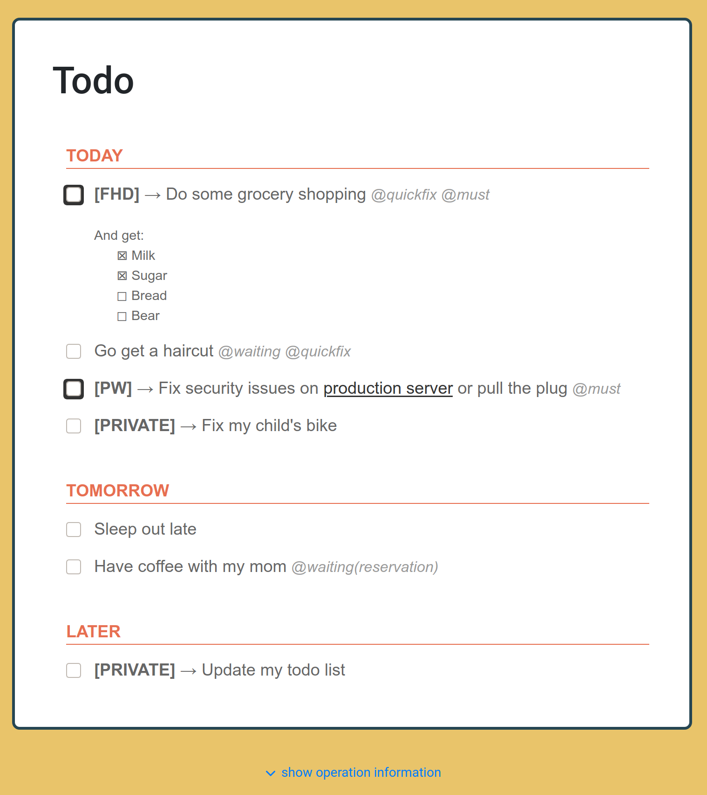

# Todo text

Simple, client-side todo list app that stores your todos in Google firestore, for cross device access. It uses a lot of keyboard shortcuts and Markdown-like syntax for formatting.

## Screenshot

